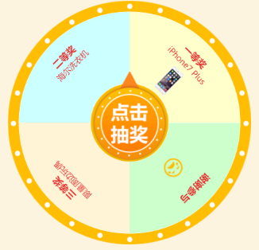

# turnplate.js实现自定义大转盘

## 立即使用

```
<link href="css/turnplate.css" rel="stylesheet" type="text/css">
<body>
  <div class="turntable">
	<div class="turnplate">
		<canvas id="wheelcanvas"></canvas>
		
	</div>
  </div>
<script type="text/javascript" src="turnplate.js"></script>
</body>
```

```
var turnplateConfig = {
    canvasID: "wheelcanvas",
    awardList:[],               //大转盘奖品名称
    awardColor:"#E5302F",       //大转盘奖项文字颜色
    turnplateRadius: 420,       //大转盘半径
    outsideRadius:192,          //大转盘外圆的半径
    insideRadius:68,            //大转盘内圆的半径
    textRadius:155,             //大转盘奖品位置距离圆心的距离
    startAngle: 0,               //开始角度
    showAwardName: true,        //是否显示奖项名字
    showAwardImg: false,         //是否显示奖项图片
}
var turnplate = new Turnplate(turnplateConfig);
turnplate.init();
```

插件需要引入jQuery和jQuery.rotate两个js文件

[](assert/demo.png)

## Options 参数

- awardList: 奖品列表
- canvasID: 绘制奖品canvas的id
- startAngle: 转盘开始绘制角度(顺时针)
- turnplateRadius: 大转盘绘制半径
- outsideRadius: 大转盘外圆半径
- insideRadius: 大转盘内圆半径
- textRadius: 大转盘奖品位置距离圆心的距离
- showAwardName: 是否显示奖项名字  默认为false
- showAwardImg: 是否显示奖项图片  默认为false
- awardTitleSize: 奖项大标题文字大小  默认为16px
- awardNameSize: 奖品名称文字大小   默认为14px
- awardColor: 转盘文字颜色   默认为'#666'

awardList格式：
```
[{
	title:"",//转盘奖项标题，如：一等奖，二等奖，幸运奖
	name:"",//转盘奖品名称(非必须)
	icon:"",//转盘显示的奖品图片的id(非必须)
    background:"#CCFFCC",//转盘奖品区背景
    startAngel:0,//当前转盘奖品开始绘制角度(从0开始)
    endAngel:90,//当前转盘奖品绘制结束角度(360结束)
}]
```
>注意：转盘上如果需要显示奖品图片需要在HTML中加入img标签，id为awordList中icon的对应值，并实现设为隐藏


## 方法
```
init() //初始化大转盘
```

```
rotateFn(award,callback) //旋转大转盘
```

- award: 中奖所获奖品，对应 awardList 的所在项
- callback: 转盘旋转后的回调函数，显示中奖情况

>使用如下

```
$('.pointer').click(function (){
    turnplate.rotateFn(turnplateConfig.awardList[0],function(){
        alert(turnplateConfig.awardList[0].title);
    });
});
```

## 结语
改插件为自己封装的插件，仅供学习交流，如有不足请指正
